# PET CUP Syringe Needle Adapter
3D printable PET CUP Adapter and Adapter to Syringe Needle. Created with Rhino 8.

When working on electronics repairs, I often use isopropyl alcohol to clean flux residue. I typically purchase 1L bottles, but it’s difficult to dispense small amounts from such a large bottle. To solve this, I refill a small 100ml bottle equipped with a syringe needle.

The 100ml bottle has a 7mm diameter opening for refilling, but it’s not easy to use. To make the refilling process more convenient, I designed a set of adapters to fit PET bottle threads.

I printed the adapters in PETG, using a 0.25mm nozzle and a 0.07mm layer height. All parts fit perfectly.

The syringe needle adapter features a dual-helix thread for a secure connection.

Requirements:
* 3D printer 
* Filament of your choice

## View

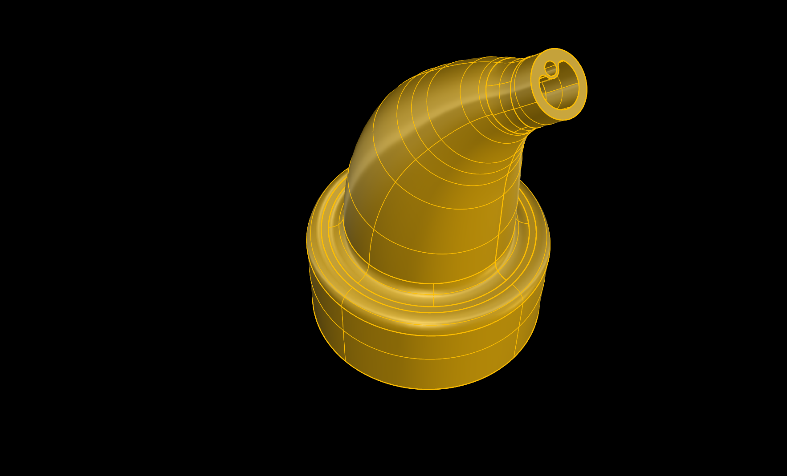 
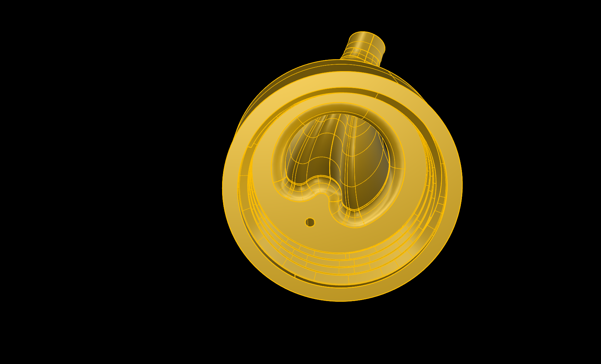

  

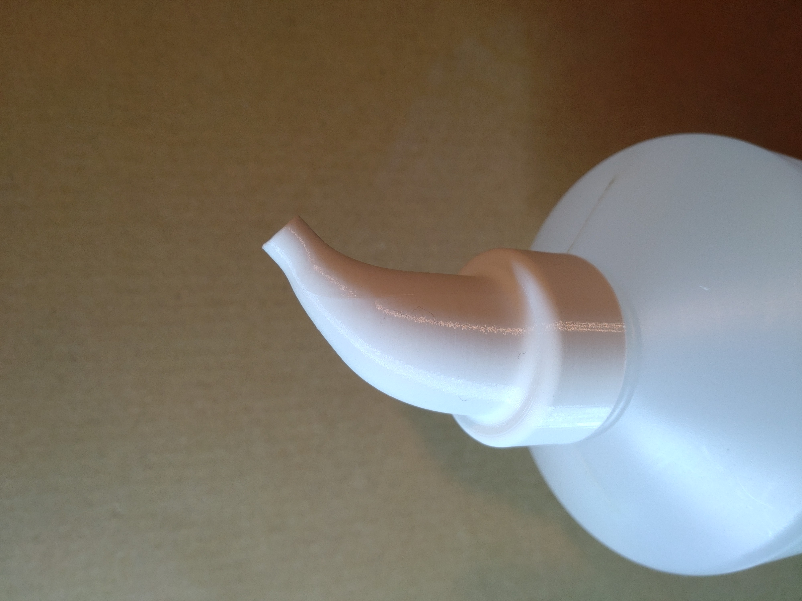
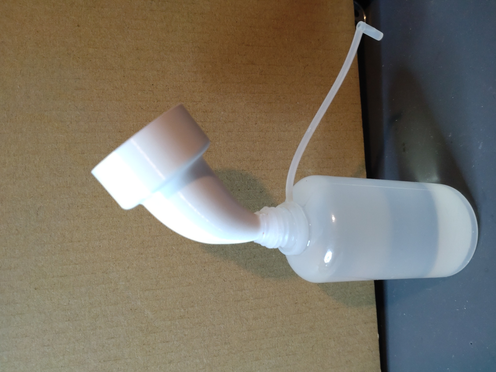

  

 
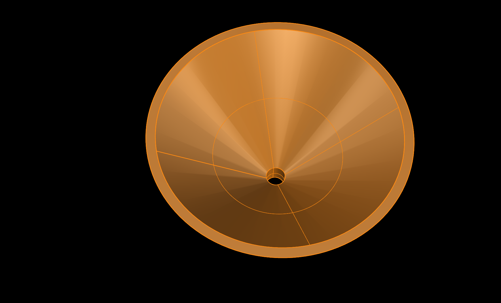
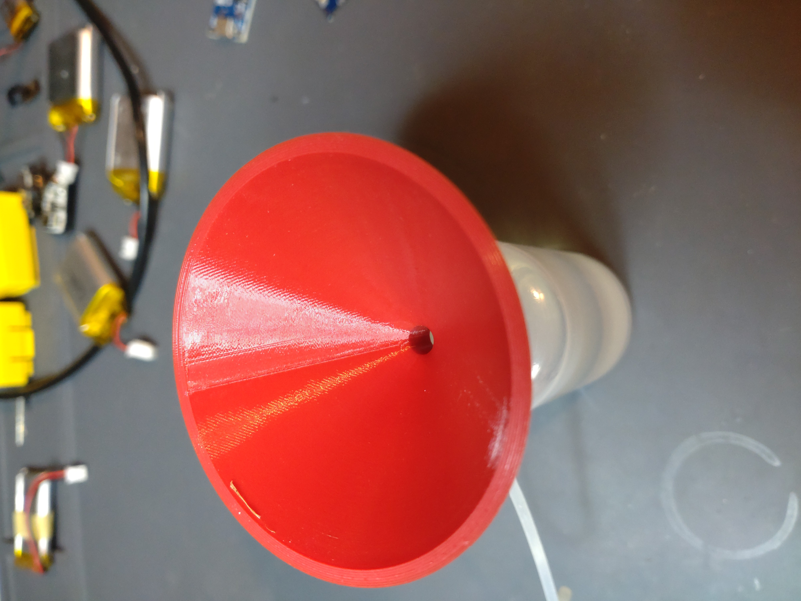

  

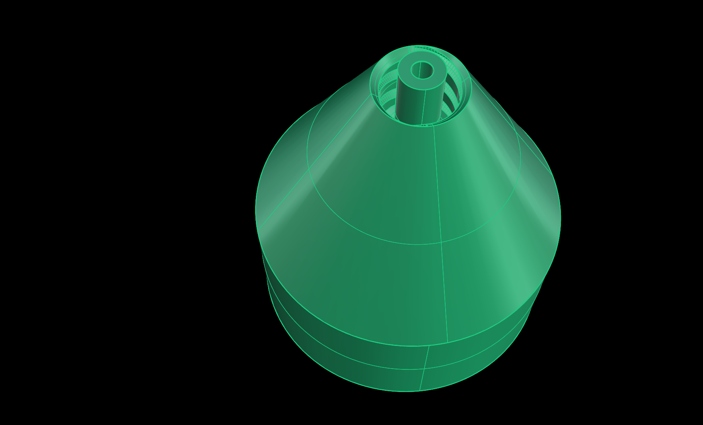 
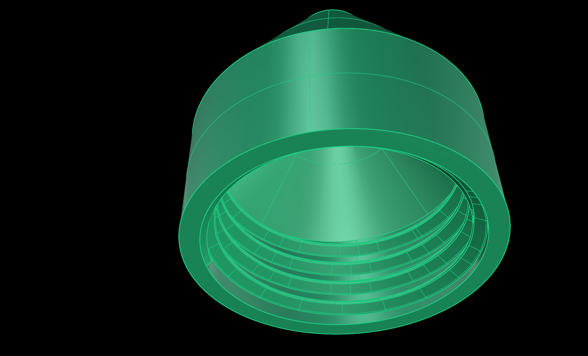

  

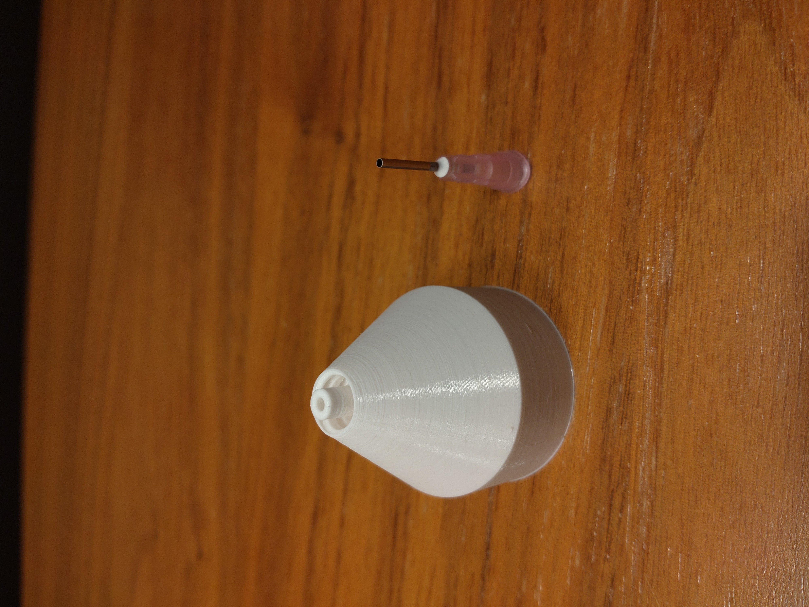
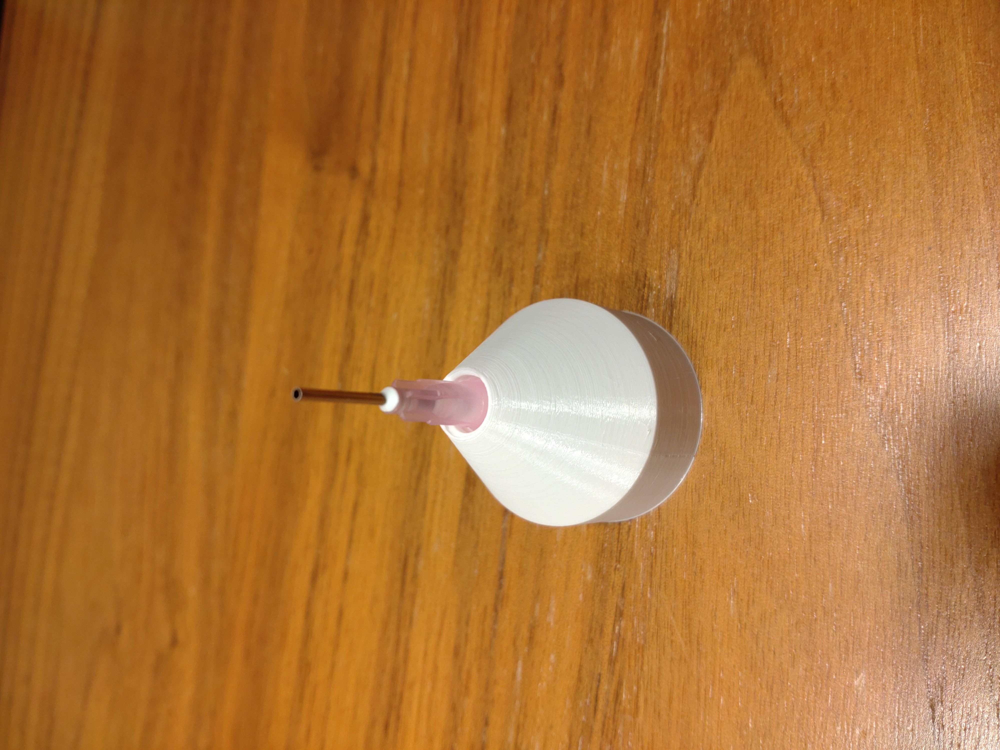

  

# Glue Bottle Syringe Needle Adapter

I added a syringe needle adapter for glue bottles.

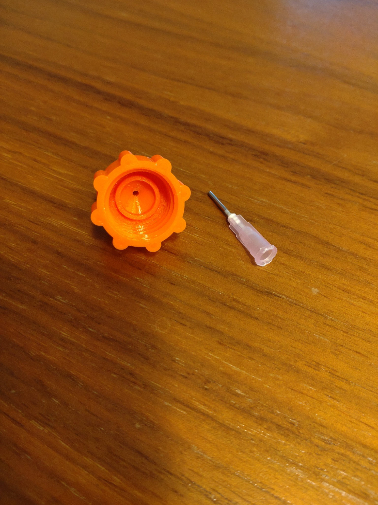

  

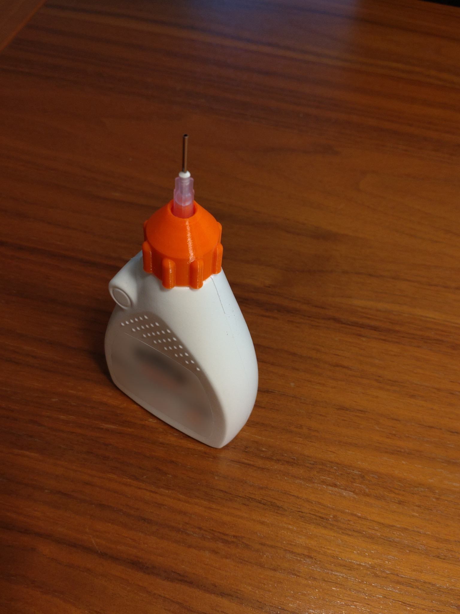

  
